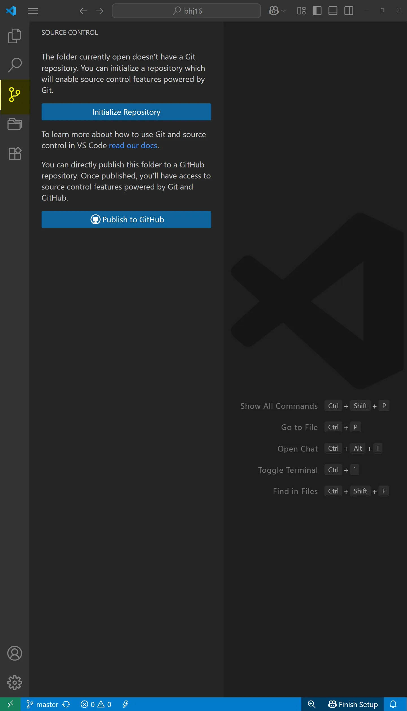
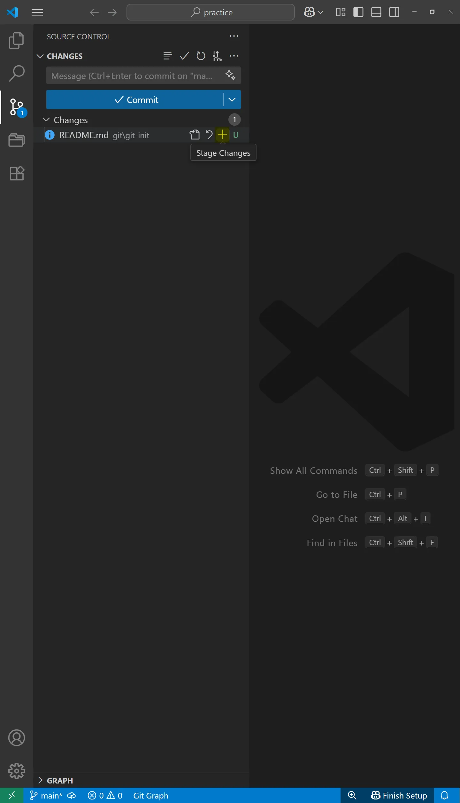
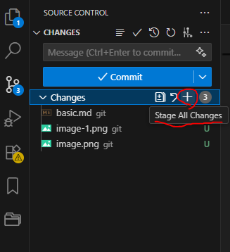
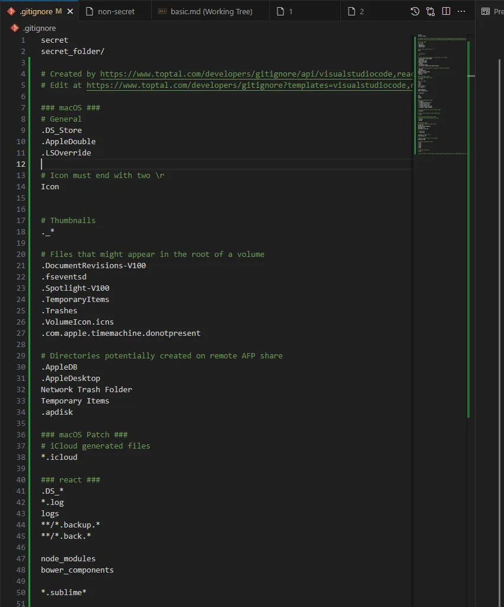
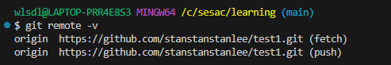
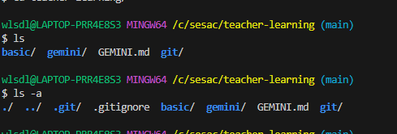
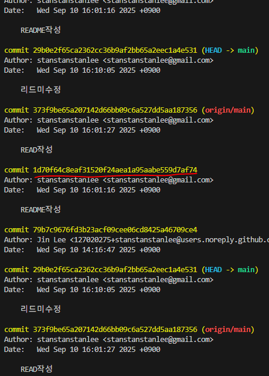

# 깃 개념


## 스냅샷
- 마치 폴라로이드 카메라로 풍경을 기록하듯이 파일의 상태를 기록하는 시스템
- 한 번 기록하면 변경할 수 없다

## git init
- "이 폴더를 이제부터 Git으로 버전 관리할 거야" 라고 선언하고, 버전 관리에 필요한 환경을 만들어주는 명령어
- 내가 작업할 폴더 안에 .git 폴더를 새로 만든다. 
  여기 안에는 커밋 기록, 브랜치, 스테이징 영역, 설정 정보가 다 들어감
> `.git` 폴더란 : 이 폴더가 바로 Git 저장소(Repository)의 본체. 
- 우리가 만드는 버전 정보, 변경 이력, 설정 등 Git이 프로젝트를 관리하는 데 필요한 모든 데이터가 이 .git 폴더 안에 저장됨

> 그냥 폴더는 “메모장” 같은 공간일 뿐. git init을 하면 “비밀 일기장(.git)”을 달아주는 거라, → 앞으로 무슨 일이 있었는지 시간별로 기록할 수 있음.

## 3가지 영역
   ### 1. 작업 트리 (working tree)
- Git이 관리하는 프로젝트
- 가장 최근 커밋(저장소)과 비교하여 수정된(변경된) 파일의 영영
- 의 실제 디렉토리(사용자가 직접 보고 수정하는 공간).
- 내가 실제로 수정한 파일들이 있는 곳. 내가 보고 수정하는 **프로젝트 디렉토리**
- VSCode, 메모장 등에서 파일을 수정하면 전부 여기에서 일어남.
- 아직 Git에 저장된게 아니라 그냥 "현재 수정된 상태"
  
### 2. 스테이징 영역 (staging area)
- 저장소에 기록하기 위해 임시로 선택된 파일의 영역
- 커밋 하기 전에 잠시 올려두는 대기 공간. 다음 커밋에 포함할 파일들을 모아두는 준비 공간
- `git add 경로/파일명` 하면 → 수정한 파일이 이곳으로 복사됨. 커밋할 파일이 이 영역으로 올라옴.
- _다음 커밋에 포함될 후모 목록_ 을 관리하는 중간 공간. 
- 한꺼번에 수정 했어도 **원하는 파일만 골라 커밋** 할 수 있도록 하는 영역. 
- 
### 3. 저장소 (local repository)
- `git commit` 하면  -> 스테이징 영역에 있던 파일이 영구히 저장됨. 
- 이력 (history) 으로 남아서 `git log`로 확인 가능
- `.git` 폴더 안에 있음. 
  
---
# 깃 명령어
## 변경된 파일을 스테이징 영역으로 이동하는 명령어
변경 (modified) -> 스테이징 (Staged)
  - `git add 경로/파일명` : 변경된 파일을 선택해서 스테이징 영역으로 이동
  - `git add .` : 모든 변경된 파일을 스테이징 영역으로 이동

## 스테이징 영역에 있는 파일을 기록(커밋)하는 명령어
스테이징 (staged) -> 커밋 (commited)
  - `git commit` : 커밋 하는 명령어
  - `git commit -m "커밋 메세지"` : 스테이징 영역에 있는 파일을 로컹 저장소에 저장
  - 커밋 메세지 (commit message) : 개발을 햇으면 개발을 했다고 알려줘야함. 커밋 메세지를 통해서 뭘 했다라는걸 나타내야함. 
    - 커밋 메시지 컨벤션이 따로 있음

## 현재 파일 상태를 출력 하는 명령어
- `git status` : git 프로젝트의 현재 상태를 출력
- `git diff <파일명>` : 특정 파일의 변경 내용출력
- `git diff --staged` : 스테이징 영역과 최근 커밋의 차이 출력
- `git log` : 커밋 기록 확인 (잘 쓰지 않음)
---

# VSCode Git GUI
VSCode에서 Source Control을 통해 git을 제어 할 수 있다


> git add 버튼 처럼 스테이징 영역으로 이동시킴
---
## git add . 명령어 버튼 <한번에 모든 파일을 스테이징 영역으로 이동>


---
# .gitignore
## 어떤 파일인가? 역할이 무엇인가?
- Git에게 **이 파일들은 추적하지마라** 라고 알려주는 설정 파일.
- 버전 관리할 필요 없는 파일(임시 파일, 로그, 빌드 산출물, 개인 설정 파일등)을 Git 저장소에서 제외할 때 사용.
#### 역할 :
- 불필요한 파일이 Git 저장소에 올라가는 걸 방지. 
- 협업 시 팀원 마다 다른 **환경 설정 파일 (.env, IDE 설정, OS 캐시 파일등)**이 올라가 충돌하는 걸 막음. 
- 보안상 민감한 정보 (**API Key, 비밀번호, 인증서)가 실수로 커밋 되는 것을 막음.
  
## .gitignore의 주의사항은 무엇인가?
### 주의할 점

처음 부터 gitignore에 안넣고 커밋을 해서 저장소로 옮긴 뒤에 다시 gitignore에 넣으려고 하면 작업트리로 가버린다. 

- 한번이라도 저장소에 가게된 파일은 gitignore에 등록을 해도 흐름을 벗어 날 수가 없다.

- 이미 추적 중인 파일은 .gitignore에 추가해도 무시되지 않음.
  - 해결: git rm --cached 파일명으로 추적에서 제거해야 함.

- .gitignore는 로컬뿐 아니라 저장소에 같이 올라가야 팀원 전체에 적용됨.

- 너무 광범위하게 작성하면 필요한 파일까지 무시될 수 있음(예: *.json 전체 무시).

- 보안 민감 파일은 가능하면 아예 커밋하기 전에 .gitignore에 추가해야 안전.

## gitignore.io는 어떤 서비스인가?
무엇을 gitignore에 넣어야 하는지 넣지 말아야 하는지 판단 하기 위한 사이트
#### 개발 환경별(언어, IDE, OS)로 필요한 .gitignore 템플릿을 자동 생성해주는 서비스.

# 프로젝트를 시작 할때 가장 먼저 해야 하는것

저장소에 포함되면 안되는 파일들


> 본인 환경에 맞게 검색

```md
# Created by https://www.toptal.com/developers/gitignore/api/visualstudiocode,react,macos,windows
# Edit at https://www.toptal.com/developers/gitignore?templates=visualstudiocode,react,macos,windows

### macOS ###
# General
.DS_Store
.AppleDouble
.LSOverride

# Icon must end with two \r
Icon


# Thumbnails
._*

# Files that might appear in the root of a volume
.DocumentRevisions-V100
.fseventsd
.Spotlight-V100
.TemporaryItems
.Trashes
.VolumeIcon.icns
.com.apple.timemachine.donotpresent

# Directories potentially created on remote AFP share
.AppleDB
.AppleDesktop
Network Trash Folder
Temporary Items
.apdisk

### macOS Patch ###
# iCloud generated files
*.icloud

### react ###
.DS_*
*.log
logs
**/*.backup.*
**/*.back.*

node_modules
bower_components

*.sublime*

psd
thumb
sketch

### VisualStudioCode ###
.vscode/*
!.vscode/settings.json
!.vscode/tasks.json
!.vscode/launch.json
!.vscode/extensions.json
!.vscode/*.code-snippets

# Local History for Visual Studio Code
.history/

# Built Visual Studio Code Extensions
*.vsix

### VisualStudioCode Patch ###
# Ignore all local history of files
.history
.ionide

### Windows ###
# Windows thumbnail cache files
Thumbs.db
Thumbs.db:encryptable
ehthumbs.db
ehthumbs_vista.db

# Dump file
*.stackdump

# Folder config file
[Dd]esktop.ini

# Recycle Bin used on file shares
$RECYCLE.BIN/

# Windows Installer files
*.cab
*.msi
*.msix
*.msm
*.msp

# Windows shortcuts
*.lnk

# End of https://www.toptal.com/developers/gitignore/api/visualstudiocode,react,macos,windows

```
↑ 이런식으로 나옴


↑이렇게 .gitignore 파일에 붙여넣기 한다 

---
# github

원격저장소 : 내가 직접적으로 접근 할 수 없는 저장소. 네트워크 혹은 웹. 클라우드 서비스를 떠올리면 된다. 

원격 저장소를 제공하는 곳은 여러곳이 있음

e.g. GitHub, GitLab (기업에서 씀)

원격 저장소를 생성 해야 한다

### 원격 저장소 생성, 연결, 동기화
1. 원격 저장소 생성
2. 지역 저장소 - 원격 저장소 연결
3. 지역 저장소 -> 원격 저장소 push
4. 원격 저장소 파일 생성
5. 지역 저장소 <- 원격 저장소 pull

## 지역(local) 저장소 vs 원격(remote) 저장소

### 원격 저장소랑 무엇인가?
- 원격저장소 : 내가 직접적으로 접근 할 수 없는 저장소. 네트워크 혹은 웹. 클라우드 서비스를 떠올리면 된다. 
  - 원격 저장소를 제공하는 곳은 여러곳이 있음
  - e.g. GitHub, GitLab (기업에서 씀)

### 지역 저장소와 원격 저장소의 구분
- 지역 저장소 Local Repository: 로컬 저장소. 
  - **내 컴퓨터 안에 있는 Git 저장소.**
  - `git init` 하면 만들어지는 `.git` 폴더가 바로 지역 저장소이다. 
  - 내가 `git add`하고 `git commit` 한 기록들이 여기 쌓임. 
  - 특징: 인터넷 없어도 혼자서 버전관리 가능.
  - 내가 쓰고 고치고 기록해도 나 혼자만 볼 수 있음. 
- 원격 저장소 Remote Repository: 내가 접근 할 수 없는 저장소. 
  - GitHub, GitLab, Bitbucket 같은 **온라인 서버에 있는 저장소**
  - 여러 사람이 접근해서 같은 프로젝트를 같이 작업할 수 있음. 
  - `git push` 하면 내 기록이 올라가고, 
  - `git pull` 하면 다른 사람 기록이 내려옴. 

#### 원격 저장소 주의할점 : 
  원격 저장소, 로컬 저장소에서 둘다 커밋 이력을 볼 수 있음. 
  원격 저장소와 로컬저장소의 커밋 이력은 일치 해야함. 불일치 하는 경우가 있으면 안됨. 충돌이 일어남. 
  Pull 이라는 과정을 꼭 해줘야함. 동기화된 상태를 꼭 유지 해야 함. 

### 지역 저장소와 원격 저장소의 동기화란 무엇인가?

## 명령어
  
#### 지역 저장소 - 원격 저장소 연결 : 
- `git remote add <원격저장소명><원격저장소주소>`

### 로컬 저장소에 커밋된 내용 -> 원격 저장소로 업로드 (동기화)
- `git push <원격저장소명><브랜치명>`
  - `origin` 이라는 원격저장소명은 관습적인 이름. 연결할 이름. 

#### 원격 저장소에 있는 내용을 내 로컬 저장소로 가져와서 병합
- `git pull <원격저장소명><브랜치명>`

- `git remote -v` : 원격 저장소 주소 목록 보기 명령어



### 깃허브에서 원격 저장소를 삭제해도 로컬 저장소와의 연결은 남아 있음 그걸 지워야 함
`git remote remove <원격저장소명>`
- e.g. `git remote remove origin`
- 
**github 상에서는 스테이징이 없음**


# 원격 저장소 복제
- 왜 복제라고 하는지?

클론이라는 명령어를 쓴다. 

git clone을 했는데 
.git 폴더가 생김 



git은 commit을 주체로 파일을 관리한다. 
클론을 하면 
git graph에서 커밋 기록도 똑같이 생김
즉 깃 클론은 commit이력도 같이 가져온다
연결을 하지 않아도 원격저장소 연결과 커밋이력이 유지 된다. 


# README.md
- README에 작성한 내용이 main에 나타난다. 
- 내 github 저장소를 소개 하는 문서
- 루트 디렉토리 (최상위) 위치에 있어야 한다

# 커밋 되돌리기
**어디**로 되돌릴것이냐 하는 개념이 들어감
커밋이 여러개 있을때 
e.g. 1~8번 커밋중 5번째 커밋 했던 곳으로 돌아가고 싶다. 그 커밋의 햐쉬값을 적는다 


commit 뒤에 hash가 있음 : 커밋의 주소

### 되돌리기 명령어
`git reset <커밋해쉬>`
커밋 해쉬는 적은길이 버전이 따로 제공된다. 편의성을 위해. 
원문 해쉬값을 다 써도 되긴 하지만 보통 간추린 버전을 쓴다. 그걸로 충분이 인식 됨.

push를 하기전의 커밋으로 돌아가면 안된다

### reset 옵션
`-soft`
  - 커밋만 취소 된다
`-mixed`
  - 커밋과 add가 (stage area로 add 한것들)취소 된다 
`-hard`
  - 

생량 할 경우 `-mixed`가 디폴트값으로 적용 된다. 