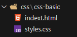

# CSS Cascading Style Sheets
- html 보다는 좀더 프로그래밍 언어에 가까운거 같음. e.g. 변수명이 있음

### HTML과 CSS의 역할 구분
- HTML : 웹 페이지의 구조와 내용을 정의
- CSS : 웹 페이지의 스타일을 정의

## 기본 구조
- 선택자, 속성, 값

```css
선택자 {
  속성 : 값;
}
```

선택자 (selector)
- 스타일을 적용할 HTML 요소를 선택한다
- 요소를 선택 하는 여러가지 방법중 하나
```css
/* h1 태그를 선택 */
h1 {
}

/* class가 "title"인 요소를 선택 */
.title {
}

/* id가 "header"인 요소를 선택 */
#header {
}

```

## 속성(property)과 값(value)
- 속성 : 스타일(글자 색, 크기, 너비, 높이등)의 종류
- 값 : 스타일의 구체적인 값

```css
p {
  color: red; /* 빨간색 */
  font-size: 16px; /* 16픽셀 크기 */
  background-color: yellow; /* 노란색 배경 */
}

```

## CSS 적용 방법
### 인라인 스타일 (inline style) **안쓰는 것이 가장 좋다**
- html 요소의 `style` 속성에 직점 CSS를 작성하는 방법
- 해당 요소에만 스타일이 적용된다 
```css
<p style="color: blue; font-size: 20px;">
  이 텍스트는 파란색이며, 크기는 20px입니다.
</p>

/** e.g. */
<h1 style="color: red">빨</h1>
```
- 늘어나면 가독성이 떨어진다


### 내부 스타일 시트(internal style sheet)
- html 문서의 `<head>` 내부에 `<style>` 태그를 사용하여 CSS 코드를 작성 하는 방법

```css
<!DOCTYPE html>
<html lang="ko">
  <head>
    <style>
      h1 {
        color: blue;
        text-align: center;
      }
      h2 {
      color: orange;
    }
      p {
        color: gray;
        font-size: 16px;
      }
    </style>
  </head>
  <body>
    <h1>웹사이트 제목</h1>
    <p>이것은 스타일이 적용된 문단입니다.</p>
    <h2>주</h2>
  </body>
</html>
```

### 외부 스타일 시트 (external style sheet)
- 외부 CSS 파일을 만들어 html 문서에 연결하는 방법
  1. 디렉토리 구조
  
   📁 leanring/
└── 📁 css/
    └── 📁 css-import/
        └── 🌐 index.html
        └── 🎨 styles.css

  2. 외부 CSS 파일 작성 
```css
/* styles.css 파일 */
h1 {
  color: blue;
  text-align: center;
}

p {
  color: gray;
  font-size: 16px;
  line-height: 1.5;
}

.highlight {
  background-color: yellow;
  padding: 5px;
}

```
3. HTML 문서에서 외부 CSS 불러오기
```css
<!DOCTYPE html>
<html lang="ko">
  <head>
    <link rel="stylesheet" href="styles.css" />
  </head>
  <body>
    <h1>웹사이트 제목</h1>
    <p>이것은 외부 CSS가 적용된 문단입니다.</p>
    <p class="highlight">이것은 강조된 문단입니다.</p>
  </body>
</html>

```

#### e.g.
```html
<!DOCTYPE html>
<html lang="en">
<head>
  <meta charset="UTF-8">
  <meta name="viewport" content="width=device-width, initial-scale=1.0">
  <title>CSS-basic</title>
  <link rel="stylesheet" href="./styles.css"> <!--상대경로 ./ 로 시작 해 주는것이 좋다-->
</head>
<body>
  <!-- HTML 문서 외부 css 파일 연결 (link 태그를 써서 연결)-->
  <h3>노</h3>
</body>
</html>
```


```css
h3 {
  color: yellow;
}
```


## 브라우저 개발자 도구
### element (요소) 메뉴
- html 구조를 확인할 수 있다
- 요소를 선택하여 해당 요소의 css를 확인할 수 있다
  
### styles(스타일) 패널
- 선택된 요소에 적용된 css 규칙을 확인할 수 있다 
- 실시간으로 css 값을 수정하여 결과를 미리 볼 수 있다
- 체크박스를 해제하여 특정 스타일을 임시로 비활성화할 수 있다

### Computed(계산된 스타일) 패널
- 요소에 최종적으로 적용된 모든 CSS값을 확인할 수 있다
- 상속받은 스타일과 직접 적용된 스타일을 구분하여 볼 수 있다

---

## 선택자
- 스타일을 적용할 html 요소를 선택 하는 방법
- 태그, 클래스, 아이디 등으로 요소를 선택함
  
## 기본 선택자
### 전체 선택자 (Universal Selector)
- 문서 내 모든 요소 선택
```css
* {
  속성: 값;
}  
```
e.g.
```css
* {
  font-size: 100px;
}
```

## 태그 선택자
- 특정 태그의 모든 요소를 선택
- `태그명` 형태로 작성한다
```css
태그명 {
  속성: 값;
}
```

```css
/* 모든 p 태그의 글자를 파란색으로 만들기 */
p {
  color: blue;
}

/* 모든 h1 태그의 글자를 크고 굵게 만들기 */
h1 {
  font-size: 32px;
  font-weight: bold;
}

```

## 클래스 선택자 (class selector)
- 특정 클래스의 모든 요소를 선택
- 여러 요소에 같은 클래스를 사용할 수 있다
- 하나의 요소에 여러 클래스를 사용할 수 있다
- 재사용성이 높다
- `.클래스명` 형대로 작성한다  
  - **.점을 붙여서 쓴다 라는것이 중요함**


## 아이디 선택자 (id selector)
- **#샵을 붙여서 쓴다**


## 속성 선택자 (attribute selector)
- 특정 속성을 가진 요소를 선택
- [속성명] 형태로 작성한다

```css
  
```

## 관계 선택자 
```html
<body>
  <p class="red font-200">빨강 200</p>
  <p class="green font-200">초록 200</p>
  <p class="red font-50">빨강 50</p>
  <p class="blue font-50">파랑 50</p>
  <p id="bold" class="red font-50">빨강 50 굵게</p>
  <a href="https://www.naver.com">naver</a>
  <a href="https://www.google.com">google</a>

  <div>
    <p></p>
    <p></p>
  </div>
</body>
```
- body와 p태그,a태그는 부모와 자식이다
- body 태그 안에있는 p태그와 a태그 와 div 태그 들은 서로 모두 형제 관계이다. 같은 블록에 있음. 

- body안에 있는 p와 div 안에 있는 p는 관계가 다르다
- body안에 있는 p태그들은 부모가 body이다
- div안에 있는 p태그들은 부모가 div이다. 선택 하는 방법이 다르다. 


```html
  <div id="parent">
    <p class="child">id가 #parent인 div의 자식</p>
    <p class="child">id가 #parent인 div의 자식</p>
    <p>id가 #parent인 div의 자식</p>
  </div>
```
```css
#parent > .child { /*id가 parent인 요소안의 class가 child인 요소들을 선택*/
  color: violet;
}
```

### 자손 선택자 (decendent selector)
- 꺽쇠가 없음 
```css
부모선택자 후손선택자 {
  속성: 값;
}
```

### 그룹 선택자 (group selector)

### 혼합 선택자

### 우선순위
1. !important: CSS 속성을 **강제로 우선시** 하는 키워드
2. ~~요소 인라인 스타일~~: 요소에 직접 적용된 스타일 (인라인은 안쓰는거싱 좋음)
3. id 선택자
4. class 선택자
5. tag 선택자
6. 우선순위가 같은경우 나중에 작성된 선택자가 우선순위를 같는다. 

# 속성

- color
- font
- font-weight 텍스트의 굵기를 설정
- text-align
- width
- height

## 인라인 요소 너비와 높이를 지정 할 수 없다 : 
- 인라인 요소의 크기는 자식(내부) 컨텐츠의 크기에 의해 결정된다. 

## cursor 속성
- 요소 위에 마우스를 올렸을 떄 커서 모양 지정
- 