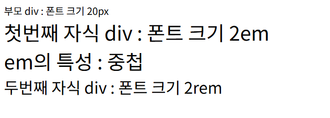
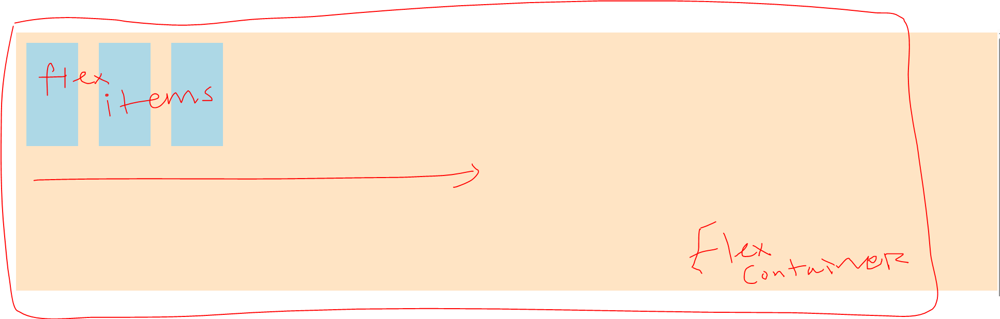
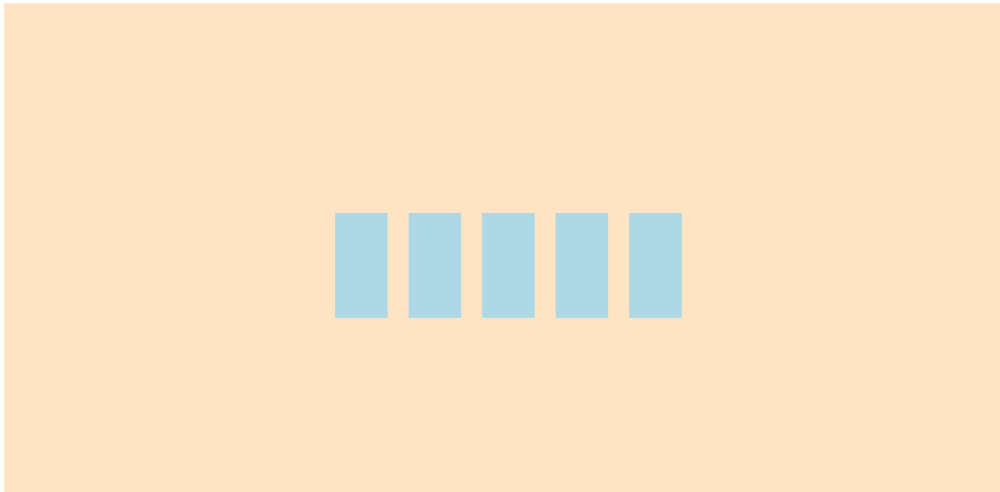

# CSS Review

## Viewport 뷰포트

사용자의화면(뷰) -> 이게 뷰포트 이다

- 사용자 화면의 너비가 1920px 이고 높이가 1080px 일 경우
  - 100vh = 1920 \* 1 이다. 백분율 이기 때문에
  - 50vh = 1920 \* 0.5 이다
  - 세로도 마찬가지 : 100 vw = 1080 _ 1; 1vw = 1080 _ 0.1

## em의 특성은 중첩이 된다

```html
<!DOCTYPE html>
<html lang="en">
  <head>
    <meta charset="UTF-8" />
    <meta name="viewport" content="width=device-width, initial-scale=1.0" />
    <title>Document</title>
  </head>
  <body>
    <div style="font-size: 20px">
      부모 div : 폰트 크기 20px
      <div style="font-size: 2em">첫번째 자식 div : 폰트 크기 2em</div>
      <div style="font-size: 2em">em의 특성 : 중첩</div>
      <div style="font-size: 2rem">두번째 자식 div : 폰트 크기 2rem</div>
    </div>
  </body>
</html>
```



---

# Flex box layout

- 레이아웃 : 박스를 어떻게 배치 할거냐

## flex box

- 유연한 레이아웃 구현
  - 기존 테이블 구조로 모든 화면에 대응 하기 어려워짐
- 개발자도구 요소에서 display 속성에 flex라고 나와 있음. Flex 박스가 보임

## Flex Container

- `부모 요소`
-

## Flex Items

- `자식 요소`

플레스 아이템을 조정 하는게 아니라 플렉스 컨테이너의 속성을 주므로 플렉스 아이템을 조정

## 주축이

- 주축이 가로(row)라면 가로로 배치
- 주축이 세로(column)라면 세로로 배치

블락요소는 줄바꿈이 발생한다.div는 블락요소이다.

## 플렉스 컨테이너(Flex Container) 주요 속성

- display: flex; 속성이 적용된 요소는 플렉스 컨테이너



- 배치 방향 : row (행) -> 이게 기본값이다
  - 방향을 지정 하지 않으면 이 형태

## 방향을 결정 하는건 flex container 이다

### 교차축

- 주축이 row이면 교차축은 위에서 아래로
- 주축이 column이면 교차축은 왼쪽에서 오른쪽

```html
<div class="flex-container d-row center align-center">
  <!-- 플렉스 컨테이너 내부 div-->
  <div class="box "></div>
  <div class="box"></div>
  <div class="box"></div>
  <div class="box"></div>
  <div class="box"></div>
</div>
```

```css
.center {
  /*주축 방향 중앙 정렬*/
  justify-content: center;
}

.align-center {
  /* align-items*/
  /* 교차축 방향 중앙 정렬*/
  align-items: center;
}
```



- 가로로도 중앙 세로로도 중앙

### `align-items`

- 교차 축(cross-axis) 기준 플렉스 아이템 정렬
- `stretch` (기본값): 아이템이 컨테이너 높이에 맞춰 늘어남
- `flex-start:` 교차 축의 시작점에서 정렬
- `flex-end:` 교차 축의 끝점에서 정렬
- `center:` 교차 축의 중앙에서 정렬
- `baseline:` 텍스트 기준선에 맞춰 정렬

### gap

- 플랙스 컨테이너에 설정하는것
- 플렉스 아이템 간의 간격을 조절함
- margin의 문제점: flex container를 쓰게 되면 item들 간의 간격을 조절 하고 싶은데 마진때문에 여백이 생김

### align-self

- align-self는 align-items 보다 우선순위가 높다

### flex-basis

-방향이 열이면 높이가 되고 방양이 행이면 너비가 된다

### flex-grow

- 컨테이너의 빈공간을 차지하는 비율

### flex-shrink

- 공간 부족시

### flex

- `flex-grow`, `flex-shrink`, `flex-basis`

---

# 반응형 웹 디자인 vs 적응형 웹 디자인

# 미디어 쿼리 (media query)

# 그리그 시스템

플렉스 박스를 12등분을 함.

```html
<div class="text-center">
  <!-- .row : 플렉스 컨테이너 -->
  <div class="row gap-3">
    <!-- .col : 플렉스 컨테이너 -->
    <div class="col-6 bg-success">col</div>
    <div class="col bg-success">col</div>
    <div class="col bg-success">col</div>
    <div class="col bg-success">col</div>
  </div>
</div>
```

6칸, 2칸 2칸 2칸 씩 나누어 갖는다는 뜻.


# margin 속성 부모-자식 상속

```html
<div class="card-header">
  <h1>홍길동</h1>
</div>
<!-- 카드 본문 : 내용, 설명 등등.. -->
<div class="card-body">
  <p>열정 넘치는 웹 프론트엔드 개발자</p>
</div>
```

- ## 부모 - 자식 태그 사이에는 margin 속성이 상속이 안된다

```css
.card-container {
  display: flex;
  flex-direction: column;
  justify-content: center;
  align-items: center;
  background-color: lightgray;
  width: 300px;
  padding: 16px;
  margin: 0 auto;
}

.card {
  background-color: white;
  height: 300px;
  padding: 16px;
  display: flex;
  flex-direction: column;
  justify-content: space-between;
}
h1,
p {
  margin: 0;
}
.card-header {
  margin: 0;
}

.card-body {
  margin: 0;
}

.card-footer {
  margin: 0;
  display: flex;
  flex-direction: row;
}
```

- 그러므로 여기서 .card-header, .card-body, .card-footer에 적용한 margin:0은 h1, p태그에 적용이 안된다.
