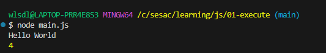

# JS

## 왜 만들어졌는가

- 웹 페이지에 동적 기능 구현을 위해 개발된 프로그래밍 언어
- 웹 페이지 개발 외에도 다양한 환경에서 사용 e.g vscode, pokerogue 게임도 js로 만듬

## Node.js

- 브라우저에서 사용하는 V8 JS 엔진을 브라우저 밖으로 가져와서 브라우저 밖에서도 코드를 실행할 수 있게 해주는 환경

## console.log()

- 브라우저 개발자 도구의 콘솔 창에 메세지 출력
- 디버깅 용도로 사용
- 그 밖에 `console.error()`, `console.warn()`, `console.inf()`, `console.table()` 등이 있다
- 브라우저 개발자 도구의 `Console` 메뉴에서 코드 실행 가능

## html에 script 태그를 추가 하는 방법 vs js 파일을 따로 만드는 방법

### body 태그의 가장 하단에 `<script>` 태그를 추가 하는것이 가장 권장되는 방식.

- 위에서 아래로 코드가 실행되는 환경에서 요소들에 대해 js가 동적인 기능을 추가 하기 때문.

- JS 파일을 따로 만드는 방법에서는 nodejs를 활용하여 파일을 실행 해야 한다.
  - `node 파일명`
  - 내가 열고싶은 파일에 접근 하기 위해선 터미널이 해당 파일과 같은 위치의 경로에 있어야 한다.
    

# 원시형

- 원시 자료형
- 가장 기본적인 데이터 타입
- 불변성 - 생성 후 값 변경 불가

`string`
`number`
`boolean`
`null`
`undefined`
`symbol`
`bigint`

## undefined vs null

- null : 개발자가 의도한 '비어있음'
- undefined : 개발자가 의도하지 않은 '비어있음'
- 둘다 '비어있다, 없다'를 표현. 변수에 데이터가 없다는 뜻

# 변수

- 변수가 메모리에 데이터를 저장하는 개념
- 데이터를 어떠한 공간에 저장을 해 두고 그 데이터를 불러와서 사용함.
  - 변수명 이라고 하는 저장공간의 이름

# 변수 이름 규칙

- 영어, 숫자, `_`, `$` 만 사용
- 숫자로 시작 하면 안된다.
- 대소문자를 구분한다.
- 예약어 사용 불가능 (let, const, if등)
  - 예약어: 프로그래밍 언어에세 이미 사용 중인 단어로, 개발자 사용 불가

## 카멜 케이스 사용

- 소문자로 시작, 다음단어의 시작은 대문자
- 의미 있는 변수 이름을 사용한다

# 연산자

- 연산을 수행하는 기호들
  - 타입 연산자: 자료형 확인
  - 산술 연산자: 수학적 계산
  - 비교 연산자: 두 데이터 비교
  - 논리 연산자: 참/거짓 논리 조합

# 나머지, 거듭제곱

- `%`= 나머지 (나눈 후 남은 값)
- `**` = 거듭제곱

# 문자열 연결

- `+` 연산자로 문자열 끼리 연결
- 문자열과 다른 자료형 `+` 연산시, 결과는 문자열
- 템플릿 리터럴을 권장

# 비교 연산자

- `>` : 초과
- `<` : 미만
- `>=` : 이상
- `<=` : 이하
- 문자열 : 사전순 비교

# 동등 비교

- `===`: 같음(엄격)
- `!==`: 다름 (엄격)

# 알파벳 비교

```javascript
const char1 = "a";
const char2 = "A";
console.log(char1 > char2); //true
```

- 아스키코드 숫자값으로 변환을 한 후 비교를 함

# `==`과 `===`의 차이

#### `==` / `!=` : 사용 하지 말것

- 값(데이터)만 비교
- 자료형이 다르면 자료형 변환 후 비교
- 절대 사용하지 말것

#### `===` / `!==` : 사용 권장

- 값과 자료형 모두 비교
- 자료형이 다르면 비교 결과가 거짓
- 데이터와 데이터의 자료형을 비교

```js
const number = 1;
const str = "1";
const bool1 = number == str;
console.log(bool1); //true

const bool2 = number === str;
console.log(bool2); //false
```
