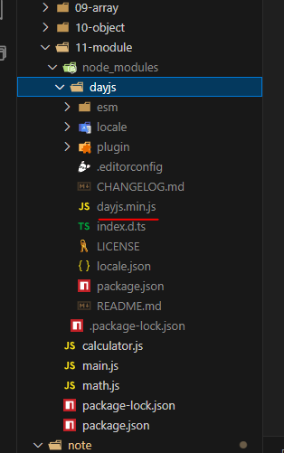

# NPM : node package manager

package : 모듈의 집합

## 전역 패키지 설치

## dependency : 패키지 목록

- 의존성 : 내 프로젝트가 정상적으로 동작하려면 반드시 필요한 외부 패키지/라이브러리

- .min : 용량을 최소화 시킴 (합축)
- 패키지를 배포할때 용량을 줄이기 위해 코드를 모두 한줄에 적어서 줄임.
- minify-js.com : 에서 최소화 시킬 수 있음.

# node_modules에 있는 것들은 git에 올라가면 안됨. git으로 관리가 되면 안됨

- .gitignore로 node_modules를 무조건 깃에서 제외 시켜야 한다

#### npm install 만 실행 하게 되면 package.json과 package-lock.json을 읽어서 자동으로 이 프로젝트를 위해 필요한 패키지가 무엇인지 알아본다.

# npm install

- 활용 용도
  - package.json을 읽어서 dependencies를 읽고 이 프로젝트를 실행 하기 위해 필요한 패키지들을 자동으로 설치 해 준다.
